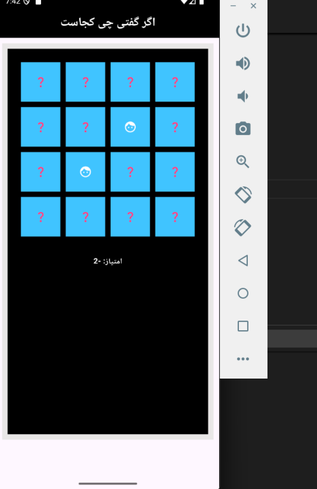
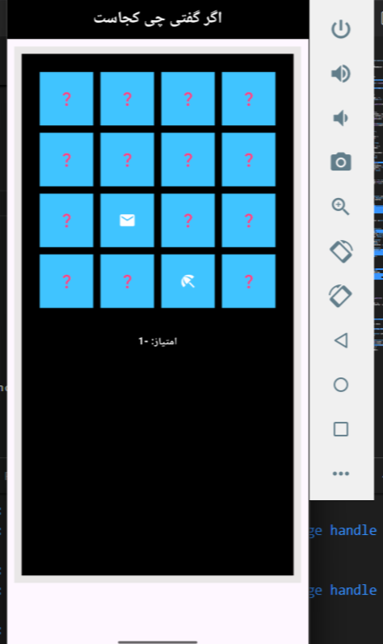

# Memory Match Flutter

یک بازی ساده اما سرگرم‌کننده برای تقویت حافظه که با استفاده از فریم‌ورک Flutter توسعه داده شده است. بازیکن باید آیکون‌های مشابه را پیدا کند و با تطبیق درست آن‌ها امتیاز بگیرد. اگر دو آیکون انتخاب‌شده متفاوت باشند، پنهان می‌شوند و امتیاز از دست می‌دهید.

---

## 🎮 ویژگی‌های بازی

- ساخته شده با Flutter و Dart
- طراحی مینیمال و سبک
- پشتیبانی از سیستم امتیازدهی (برد/باخت)
- ریسپانسیو برای گوشی‌ها و تبلت‌ها
- قابلیت ریست شدن بازی

---

## 📸 تصاویر از محیط بازی

  

  
  

---

